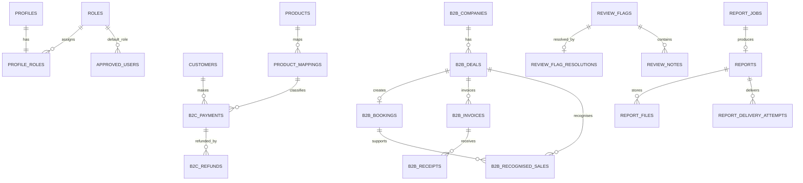

# Database Schema — Phase 2 Foundation

## Purpose

This is the persistent, auditable Supabase PostgreSQL foundation for the PLAYBOOK Financial Operating System. It preserves the Phase 1 UI and mock data. No provider, authentication, reporting, email, or scheduled-job integration is active in this phase.

## Decisions

- Only two roles exist: `admin` and `viewer`. A Viewer is read-only. Every application write is restricted by RLS to an approved Admin.
- Approved Google-login email addresses are stored in `approved_users`; `profiles` are created from `auth.users`; `profile_roles` permits one role per profile.
- The development allowlist contains fake `.test` accounts: Fatema Hasan, Walaa, and Mohammed as Admins; Wafa and Shreya as Viewers. Mohammed’s Admin access is retained for testing.
- Currency amounts are PostgreSQL `numeric(20,6)`, exchange rates are `numeric(20,10)`, and TypeScript validation accepts decimal strings. Floating point is never used for money.
- Stored system timestamps are UTC `timestamptz`. Business events and report boundaries are separate `date` fields. Bahrain-facing reporting converts/chooses business dates in the application layer; this migration does not silently infer a timezone or an FX rounding rule.
- Stable statuses are PostgreSQL enums. Provider names, deal stages, categories, and metric codes remain constrained text/lookup data so they can evolve without enum migrations.

## Entity overview

## Domain tables

| Area | Tables | Purpose |
| --- | --- | --- |
| Access | `profiles`, `roles`, `approved_users`, `profile_roles` | Google Auth profile, email allowlist, and the two-role model. |
| B2C | `customers`, `products`, `product_mappings`, `b2c_payments`, `b2c_payment_local_overrides`, `b2c_refunds` | B2C records only. Stripe and Tap source checks prevent a Stripe record becoming B2B. |
| B2B | `b2b_companies`, `b2b_deals`, `b2b_deal_stages`, `b2b_deal_stage_history`, `b2b_bookings`, `b2b_invoices`, `b2b_receipts`, `b2b_recognised_sales` | Pipeline, booking, invoice, receipt, and recognised-sales concepts stay in separate tables. |
| Finance | `financial_corrections`, `expenses`, `cash_position_snapshots`, `financial_targets`, `exchange_rates` | Explicit finance records and append-only correction entries. |
| Summit | `summit_targets`, `summit_updates` | Tickets, sponsors, booths, revenue, costs, and progress. |
| Coverage | `data_coverage` | Distinguishes an actual zero from unavailable, partial, or complete backfill. |
| Review | `review_flags`, `review_flag_resolutions`, `review_notes` | Open/resolved/dismissed review history without deletion. |
| Audit | `audit_events` | Database-triggered before/after snapshots for every Admin-write table. |
| Integration | `integration_sync_runs`, `integration_events`, `integration_errors`, `reconciliation_runs` | Idempotency, safe error state, and 48-hour reconciliation foundations only. |
| Reports | `report_jobs`, `reports`, `report_files`, `report_delivery_attempts` | Persistent job and archive structures; no report generation or email runs yet. |

## Financial history and traceability

Payments, refunds, bookings, invoices, receipts, recognised sales, expenses, corrections, and cash snapshots have no Admin delete policy. Refunds are separate rows linked to the original B2C payment, permit partial/multiple refunds, and a trigger rejects totals above the original USD amount.

`financial_corrections` captures target record, before value, after value, reason, Admin actor, and time. It does not overwrite the original record. The audit trigger independently captures the individual `auth.uid()` with a before/after snapshot for every allowed Admin write. `b2c_payment_local_overrides` stores verified Admin-only local values for one source payment (name, email, phone, category, or tier), leaving the provider row untouched. Stripe product mappings are local configuration: an Admin mapping stores a `product_mapping` correction and individual B2C classification corrections for every affected source payment, while preserving all provider IDs and source metadata.

## B2B recognised sales

`b2b_recognised_sales` is insert-only and has no automatic source. Each entry requires a deal, may additionally link its booking, and contains the recognised amount, original currency, FX rate, USD amount, recognition date, monthly reporting period, reason/reference, individual Admin, and timestamp. A trigger rejects a booking that belongs to another deal. No HubSpot, booking, invoice, or receipt action creates a recognised-sale row.

## Duplicate and backfill strategy

`b2c_payments` has a partial unique provider-ID index on `(source_system, provider_transaction_id)` and a 64-character deterministic content fingerprint index. Its direct source name, email, and phone fields are nullable so incomplete provider records remain traceable rather than disappearing. `customer_name` and `customer_phone` are stored only when the financial provider supplied them directly; absent values remain absent rather than being inferred. A missing source email creates an isolated provider-ID fingerprint and an open review flag. A verified Admin local email/category correction is a separate overlay, closes only the corresponding missing-data flag, and performs the same 48-hour duplicate check before it can be counted. Later ingestion normalizes `lower(trim(email))`, a canonical six-decimal amount, category identifier, and Bahrain business date before comparing matching fingerprints across the preceding 48 hours. A resolution note alone cannot make a payment reportable.

`data_coverage` stores source/domain date ranges with `not_started`, `partial`, `complete`, or `unavailable`. A complete range with `source_record_count = 0` means a known zero; an unavailable range does not.

## RLS overview

All application tables have RLS enabled. No anonymous table access is granted. Approved users may read dashboard, report, B2C, B2B, and source-traceability data. Only Admins may write; Viewers have no write policies. Audit and integration operational logs are Admin-only reads. Financial-source rows have no deletion policies and the database triggers enforce manual actors and audit logging.

Trusted server jobs may use the service-role client only after they are implemented. User-initiated Admin writes must use a request-scoped authenticated client so RLS and audit triggers receive the individual user identity.

## Local seed and type generation

`supabase/seed.sql` is development-only and uses fake `.test` users and records. It demonstrates a partial refund, failed payment, possible duplicate, unmapped product, unavailable history, known zero coverage, an audit event, and a failed report job. It deliberately contains no B2B deal, booking, or recognised-sale fixtures, so development seed data cannot affect B2B operations totals.

After Docker Desktop is running, reset locally then regenerate the raw types with `npm run supabase:types`. The generated file belongs at `src/types/database.generated.ts`; repositories map it to domain contracts rather than exposing it to UI components.

## Assumption

The approved access model and the later request naming only Fatema Hasan and Walaa for recognised sales conflict with Mohammed’s separately approved temporary Admin access. This foundation applies the universal rule—any current Admin can make an audited manual recognised-sales entry—so Mohammed can test it. Restricting recognised-sales data entry to named people would require a separate permission beyond the approved two-role model.
